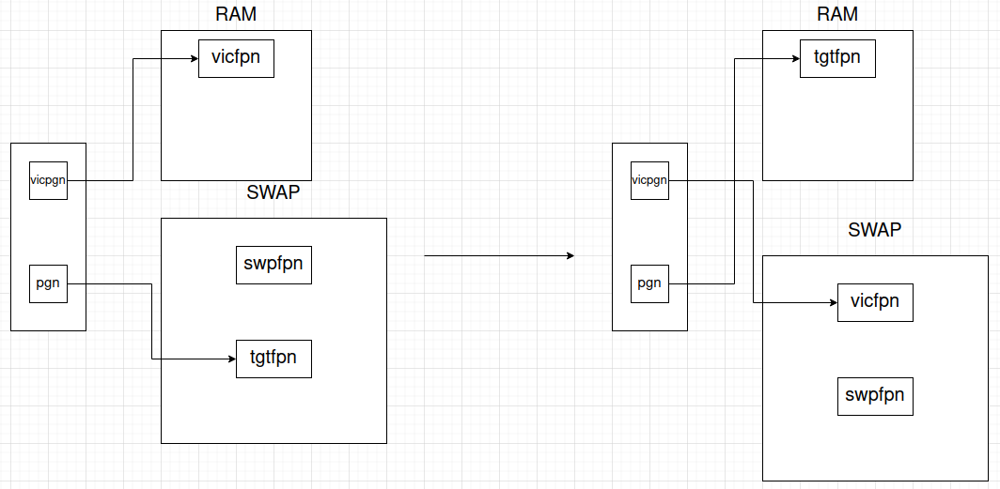

## II. Triển khai
- ```ALLOC```
    - ```c
        int find_victim_page(struct mm_struct *mm, int *retpgn)
        ```
        Tìm một "victim" page trong virtual memory:
        - Lấy một page từ cuối hàng đợi ```fifo_pgn``` mà ```mm``` đang quản lý, lưu số thứ tự của page đó vào ```retpgn```.
    - ```c
        int alloc_pages_range(struct pcb_t *caller, int req_pgnum, struct framephy_struct **frm_lst)
        ```
        Cấp phát các frame trên RAM và lưu trong danh sách ```frm_lst```:
        - Lặp qua ```req_pgnum``` lần. Ở mỗi bước lặp, kiểm tra có thể cấp phát 1 frame trong RAM. Nếu được, thêm frame vừa được cấp phát vào đầu danh sách ```frm_lst```. Nếu không, thực thi bước kế tiếp.
        - Tìm một frame ```vicfpn``` trong RAM và thay thế nó bằng một free frame ```swpfpn``` trong SWAP. Việc lựa chọn một ```vicfpn``` cần tìm một "victim" page ```vicpgn``` trong virtual memory bằng hàm ```find_victim_page```.
        - Nếu việc tìm ```vicpgn``` hoặc lấy một ```swpfpn``` trong SWAP thất bại thì giải phóng toàn bộ các frame đã được cấp phát trước đó và trả về lỗi.
        - Swap ```vicfpn``` trong RAM với ```swpfpn``` trong SWAP.
        - Set page table entry tương ứng với ```vicpgn``` bằng hàm ```pte_set_swap```, thêm ```swpfpn``` vào đầu danh sách ```frm_lst```.
    - ```c
        int vmap_page_range(struct pcb_t *caller, int addr, int pgnum, struct framephy_struct *frames, struct vm_rg_struct *ret_rg)
        ```
        Mapping các page tại địa chỉ ```addr``` với các frame trong danh sách ```frames```:
        - Duyệt qua các page, set frame page table entry tương ứng với các page bằng hàm ```pte_set_fpn```. Sau đó chèn các page đó theo thứ tự vào đầu danh sách ```fifo_pgn```.
    - ```c
        int vm_map_ram(struct pcb_t *caller, int astart, int aend, int mapstart, int incpgnum, struct vm_rg_struct *ret_rg)
        ```
        Mapping virtual memory có kích thước ```aend - astart``` với RAM:
        - Cấp phát trên RAM số lượng frame bằng với số page ```incpgnum``` trên virtual memory bằng hàm ```alloc_pages_range```, lưu các frame sau khi cấp phát thành một danh sách ```frm_lst```.
        - Nếu cấp phát thành công, map các page tại địa chỉ ```mapstart``` với các frame trong danh sách ```frm_lst``` bằng hàm ```vmap_page_range```.
    - ```c
        int inc_vma_limit(struct pcb_t *caller, int vmaid, int inc_sz)
        ```
        Tăng kích thước vùng nhớ của ```vmaid``` lên một khoảng bằng ```inc_sz```:
        - Kiểm tra ```vmaid``` nếu tăng kích thước có bị tràn qua các vmaid lân cận. Nếu có, trả về lỗi (return -1), ngược lại thực thi bước kế tiếp.
        - Dịch con trỏ ```sbrk``` và ```vm_end``` của ```vmaid``` lên thêm 1 khoảng bằng ```inc_sz```.
        - Tiến hành mapping virtual memory vừa được cấp phát sang physical memory trên RAM bằng hàm ```vm_map_ram```.
    - ```c
        int __alloc(struct pcb_t *caller, int vmaid, int rgid, int size, int *alloc_addr)
        ```
        Cấp phát cho region ```rgid``` một vùng nhớ với kích thước ```size```, sử dụng khóa mutex để bảo vệ virtual memory:
        - Nếu kích thước vùng nhớ trống của area ```vmaid >= size``` thì cấp phát thành công.
        - Nếu không đủ vùng nhớ, tăng kích thước của area ```vmaid``` lên một khoảng bằng số lượng page vừa đủ chứa ```size``` bằng hàm ```inc_vma_limit```.
        - Sau khi tăng kích thước thành công, cấp phát ```size``` cho ```rgid```.
        - Thêm fragment do paging gây ra sau khi cấp phát (nếu có) vào danh sách ```vm_freerg_list``` của ```mm```.
    - ```c
        int pgalloc(struct pcb_t *proc, uint32_t size, uint32_t reg_index)
        ```
        Thực thi hàm ```__alloc``` với ```vmaid = 0``` và ghi kết quả vào file output.
- ```FREE```
    - ```c
        int __free(struct pcb_t *caller, int vmaid, int rgid)
        ```
        Giải phóng vùng nhớ ```rgid```, sử dụng khóa mutex để bảo vệ virtual memory:
        - Nếu ```rgid < 0``` hoặc ```rgid > PAGING_MAX_SYMTBL_SZ``` hoặc ``` size rgid = 0```, trả về lỗi (return -1).
        - Gán kích thước của vùng nhớ ```rgid``` bằng 0, thêm vùng nhớ vừa được giải phóng vào danh sách ```vm_freerg_list``` mà ```mm``` quản lý.
    - ```c
        int pgfree_data(struct pcb_t *proc, uint32_t reg_index)
        ```
        Thực thi hàm ```__free``` với ```vmaid = 0``` và ghi kết quả vào file output.
- ```READ```
    - ```c
        int pg_getpage(struct mm_struct *mm, int pgn, int *fpn, struct pcb_t *caller)
        ```
        Lấy frame ```fpn``` tương ứng với page ```pgn```:
        - Nếu frame online (frame đang được lưu trên RAM ), trả về  ```fpn```. Nếu frame offline (frame đang được lưu trên SWAP), thực thi bước kế tiếp.
        - Tìm 1 "victim" page ```vicpgn``` trong virtual memory bằng hàm ```find_victim_page``` và lấy 1 free frame ```swpfpn``` từ SWAP. Nếu thành công, thực thi bước kế tiếp.
        - Swap ```vicfpn``` tương ứng ```vicpgn``` trong RAM với ```swpfpn``` trong SWAP.
        - Swap ```tgtfpn``` tương ứng ```pgn``` trong SWAP với ```swpfpn``` trong RAM.
        - Set swap page table entry tương ứng với ```vicpgn``` bằng hàm ```pte_set_swap```.
        - Set frame page table entry tương ứng ```pgn``` bằng hàm ```pte_set_fpn```.
        - Thêm ```pgn``` vào danh sách ```fifo_pgn``` của ```mm```, trả về  ```fpn```.  

        Hình vẽ mô tả:
        
    - ```c
        int pg_getval(struct mm_struct *mm, int addr, BYTE *data, struct pcb_t *caller)
        ```
        Đọc giá trị của ô nhớ tại địa chỉ ```addr``` và lưu vào ```data```:
        - Lấy page number và page offset từ ```addr```.
        - Lấy frame number trong RAM hoặc SWAP tương ứng với page number trong virtual memory bằng hàm ```pg_getpage```.
        - Nếu thành công, kết hợp frame number và page offset trả về physical memory. Đọc giá trị của địa chỉ vật lý này trong bộ nhớ vật lý bằng hàm ```MEMPHY_read```.
    - ```c
        int __read(struct pcb_t *caller, int vmaid, int rgid, int offset, BYTE *data)
        ```
        Thực thi hàm ```pg_getval``` để đọc 1 byte giá trị ô nhớ ở vị trí ```offset``` trong vùng nhớ ```rgid``` vào ```data```, sử dụng khóa mutex để bảo vệ virtual memory.
    - ```c
        int pgread(struct pcb_t *proc, uint32_t source, uint32_t offset, uint32_t destination)
        ```
        Thực thi hàm ```__read``` với ```vmaid = 0``` và ghi kết quả vào file output.
- ```WRITE```
    - ```c
        int pg_setval(struct mm_struct *mm, int addr, BYTE value, struct pcb_t *caller)
        ```
        Ghi ```value``` vào ô nhớ tại địa chỉ ```addr```:
        - Lấy page number và page offset từ ```addr```.
        - Lấy frame number trong RAM hoặc SWAP tương ứng với page number trong virtual memory bằng hàm ```pg_getpage```.
        - Nếu thành công, kết hợp frame number và page offset trả về physical memory. Ghi ```value``` vào địa chỉ vật lý này trong bộ nhớ vật lý bằng hàm ```MEMPHY_write```.
    - ```c
        int __write(struct pcb_t *caller, int vmaid, int rgid, int offset, BYTE value)
        ```
        Thực thi hàm ```pg_setval``` để ghi 1 byte ```value``` vào ô nhớ ở vị trí ```offset``` trong vùng nhớ ```rgid```, sử dụng khóa mutex để bảo vệ virtual memory.
    - ```c
        int pgwrite(struct pcb_t *proc, BYTE data, uint32_t destination, uint32_t offset)
        ```
        Thực thi hàm ```__write``` với ```vmaid = 0``` và ghi kết quả vào file output.
