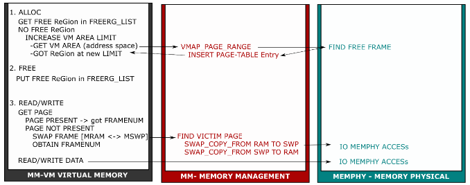

# Memory Management

## I. Các modules trong memory system

### 1. MM-VM Virtual Memory
- Không gian địa chỉ bộ nhớ ảo bao gồm:
    - Memory Area (mỗi area đại diện cho các segment của 1 process: data segment, code segment, stack segment, heap segment,...). Trong Assignment, ta chỉ sử dụng 1 memory area tương ứng vmaid = 0. 
    - Mỗi Memory Area bao gồm các Memory Region (region đang được sử dụng và region đang free).
- Lợi ích của việc thiết kế multiple segments:
    - Tổ chức bộ nhớ tốt hơn, dễ dàng quản lý và truy xuất dữ liệu: Stack segment quản lý các local variables và các function calls, Heap segment quản lý việc cấp phát động, Code segment quản lý các câu lệnh được thực thi,...
    - Giảm context switching: Khi CPU switch giữa các processes hoặc threads, chỉ những segments cần thiết mới được restore trở lại CPU để tiếp tục thực thi. Điều này hiệu quả và nhanh hơn thay vì restore toàn bộ không gian địa chỉ.
- Các operations trên virtual memory bao gồm:
    - ```ALLOC```: cấp phát 1 region memory.
    - ```FREE```: giải phóng 1 region memory.
    - ```READ```: đọc 1 byte giá trị tại 1 ô nhớ trong region memory.
    - ```WRITE```: ghi 1 byte giá trị vào 1 ô nhớ trong region memory.
### 2. MM-Memory Management
- Mỗi process có 1 module Memory Management với vai trò mapping virtual address sang physical address, cụ thể:
    - Giữ địa chỉ page table directory của process. Page table sẽ ánh xạ mỗi logical address sang page table entry.
    - Quản lý địa chỉ các virtual memory area (segment) của process.
    - Quản lý các memory region đang được sử dụng của process.
    - Quản lý danh sách các page được map với frame trong physical memory theo cơ chế FIFO.
- Memory Management quản lý logical address theo cơ chế paging (mỗi page là một không gian địa chỉ với kích thước cố định). Cấu trúc logical address 22 bit trong assignment được chia thành 2 mức, bao gồm 14 bit page number và 8 bit page offset.
- Có những lợi ích và bất lợi nếu chia logical address nhiều hơn 2 mức:
    - Giảm thiểu memory overhead: Thay vì sử dụng một page table duy nhất, ta có thể sử dụng nhiều page table nhỏ hơn, chỉ những page table được sử dụng mới được load vào physical address.
    - Đối với các hệ thống lớn (64-bit), việc chia logical address thành nhiều mức sẽ giúp giảm thiểu memory overhead nhưng lại khó quản lý nên cũng không mang lại hiệu quả.
- Lợi ích và bất lợi của segmentation with paging:
    1. Lợi ích:
        - Quản lý các segment với các page hiệu quả hơn so với việc quản lý từng địa chỉ.
        - Tránh external fragmentation.
    2. Bất lợi:
        - Internal fragmentation vẫn xảy ra vì kích thước trang là cố định.
        - Tăng độ phức tạp của việc quản lý.
### 3. MEMPHY-Memory Physical
- Không gian địa chỉ bộ nhớ vật lý bao gồm:
    - RAM: Bộ nhớ chính, có thể được truy xuất trực tiếp bởi CPU.
    - SWAP: Bộ nhớ thứ cấp, không được truy xuất trực tiếp bởi CPU, kích thước lớn hơn RAM và số lượng nhiều (assignment dùng 4 SWAP).
- Các opearions trên physical memory bao gồm:
    - ```READ```: directly đối với RAM và sequentially đối với SWAP.
    - ```WRITE```: directly đối với RAM và sequentially đối với SWAP.