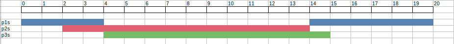
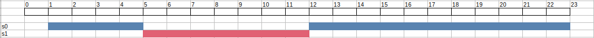
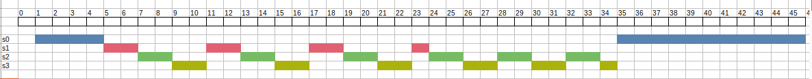

## V. Kết quả
1. TEST 1:
- Input
<table>
<td>

```
sched:
4 2 3
0 p1s 1
1 p2s 0
2 p3s 0
```
</td>
<td>

```
p1s:
1 10
calc
calc
calc
calc
calc
calc
calc
calc
calc
calc
```
</td>
<td>

```
p2s:
20 12
calc
calc
calc
calc
calc
calc
calc
calc
calc
calc
calc
calc
```
</td>
<td>

```
p3s:
7 11
calc
calc
calc
calc
calc
calc
calc
calc
calc
calc
calc
```
</td>
</table>

- Output: Kết quả chi tiết trong ```/output/sched.output```.  
Gantt diagram:  


2. TEST 2:
- Input
<table>
<td>

```
sched_0:
2 1 2
0 s0 4
4 s1 0
```
</td>
<td>

```
s0:
12 15
calc
calc
calc
calc
calc
calc
calc
calc
calc
calc
calc
calc
calc
calc
calc
```
</td>
<td>

```
s1:
20 7
calc
calc
calc
calc
calc
calc
calc
```
</td>
</table>

- Output: Kết quả chi tiết trong ```/output/sched_0.output```.  
Gantt diagram:  


3. TEST 3:
- Input
<table>
<td>

```
sched_1:
2 1 4
0 s0 4
4 s1 0
6 s2 0
7 s3 0
```
</td>
<td>

```
s0:
12 15
calc
calc
calc
calc
calc
calc
calc
calc
calc
calc
calc
calc
calc
calc
calc
```
</td>
<td>

```
s1:
20 7
calc
calc
calc
calc
calc
calc
calc
```
</td>
<td>

```
s2:
20 12
calc
calc
calc
calc
calc
calc
calc
calc
calc
calc
calc
calc
```
</td>
<td>

```
s3:
7 11
calc
calc
calc
calc
calc
calc
calc
calc
calc
calc
calc
```
</td>
</table>

- Output: Kết quả chi tiết trong ```/output/sched_1.output```.  
Gantt diagram:  
